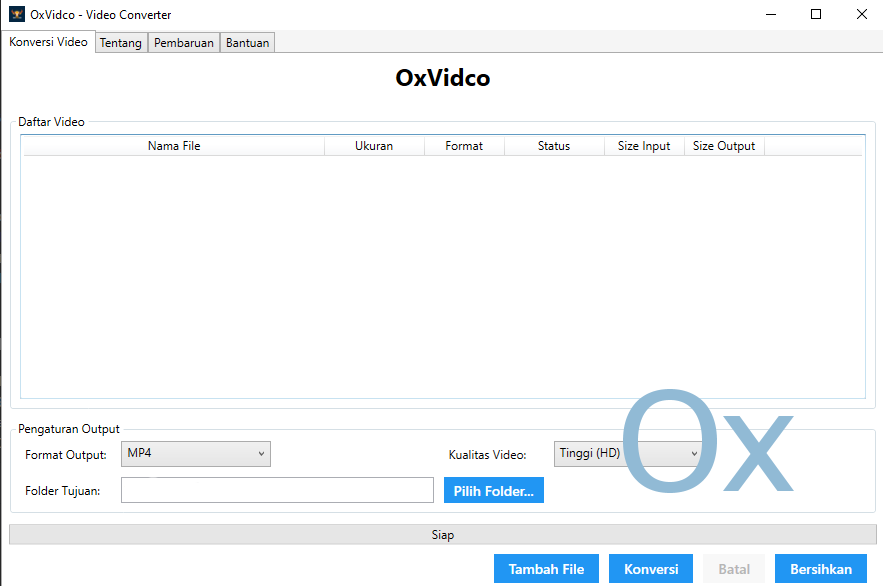

<div align="center">
  <h1>OxVidco</h1>
  
  [](https://github.com/Azalea2n/OxVidco/actions/workflows/dotnet.yml)
  [](LICENSE)
  [](https://dotnet.microsoft.com/download/dotnet/9.0)
  
  
  
  
  
  

  <p>Aplikasi konversi video yang ringan dan mudah digunakan, mendukung berbagai format video populer dengan kualitas tinggi.</p>

  
</div>

## 🚀 Fitur Utama

- 🎥 Konversi video ke berbagai format (MP4, AVI, MKV, MOV, WMV)
- ⚙️ Dukungan kualitas video yang dapat disesuaikan
- 🖥️ Antarmuka pengguna yang ramah dan mudah digunakan
- 📂 Dukungan drag and drop untuk file video
- 📊 Tampilan progress konversi yang informatif
- 🔄 Pembaruan otomatis
- 🌐 Dukungan multi-bahasa

## 📋 Persyaratan Sistem

- **Sistem Operasi**: Windows 10/11 (64-bit)
- **.NET Runtime**: .NET 9.0 atau yang lebih baru
- **Penyimpanan**: Minimal 500MB ruang kosong
- **RAM**: Minimal 4GB (8GB direkomendasikan)
- **Resolusi Layar**: 1366x768 atau lebih tinggi

## 🚀 Cara Memulai

### Unduh dan Instal
1. Unduh versi terbaru dari [halaman rilis](https://github.com/Azalea2n/OxVidco/releases)
2. Jalankan file installer
3. Ikuti petunjuk instalasi

### Penggunaan Dasar
1. **Menambahkan Video**:
   - Klik tombol "Tambah File" atau drag & drop file video ke aplikasi
   - Pilih satu atau beberapa file video sekaligus

2. **Pengaturan Konversi**:
   - Pilih format output dari daftar yang tersedia
   - Sesuaikan kualitas video jika diperlukan
   - Tentukan folder tujuan untuk file yang sudah dikonversi

3. **Memulai Konversi**:
   - Klik tombol "Konversi"
   - Pantau progress konversi di panel bawah
   - File yang sudah selesai akan muncul di daftar "Selesai"

## 🛠️ Pengembangan

### Prasyarat Pengembangan
- [.NET 9.0 SDK](https://dotnet.microsoft.com/download/dotnet/9.0)
- Visual Studio 2022 atau VS Code
- Git

### Membangun dari Sumber
```bash
# Klon repositori
git clone https://github.com/Azalea2n/OxVidco.git
cd OxVidco

# Restore paket NuGet
dotnet restore

# Jalankan aplikasi
dotnet run
```

### Berkontribusi
Kami sangat menghargai kontribusi Anda! Berikut cara berkontribusi:
1. Fork repositori ini
2. Buat branch fitur (`git checkout -b fitur/namafitur`)
3. Commit perubahan Anda (`git commit -m 'Menambahkan fitur baru'`)
4. Push ke branch (`git push origin fitur/namafitur`)
5. Buat Pull Request

## 📄 Dokumentasi

### Format yang Didukung
| Format | Ekstensi | Keterangan |
|--------|----------|-------------|
| MP4    | .mp4     | Format video standar |
| AVI    | .avi     | Format video yang umum digunakan |
| MKV    | .mkv     | Format kontainer multimedia |
| MOV    | .mov     | Format video QuickTime |
| WMV    | .wmv     | Windows Media Video |

### Pemecahan Masalah
- **Gagal mengkonversi video**: Pastikan file video tidak rusak dan formatnya didukung
- **Aplikasi tidak bisa dijalankan**: Pastikan .NET 9.0 Runtime sudah terinstal
- **Kualitas video buruk**: Coba tingkatkan kualitas output di pengaturan

## 🤝 Berkontribusi

Kontribusi, pelaporan bug, dan permintaan fitur sangat kami hargai! Jangan ragu untuk memeriksa [halaman issues](https://github.com/Azalea2n/OxVidco/issues) jika Anda ingin membantu mengembangkan OxVidco.

## 📜 Lisensi

Proyek ini dilisensikan di bawah Lisensi MIT - lihat file [LICENSE](LICENSE) untuk detail lebih lanjut.

## 📞 Kontak

- **Pengembang**: 0xniel, Azalea2n
- **Email**: [66keqing99@gmail.com](mailto:66keqing99@gmail.com)
- **GitHub**: [@Azalea2n](https://github.com/Azalea2n)

---

<div align="center">
  Dibuat dengan ❤️ oleh <a href="https://github.com/Azalea2n">Azalea2n</a>
</div>
